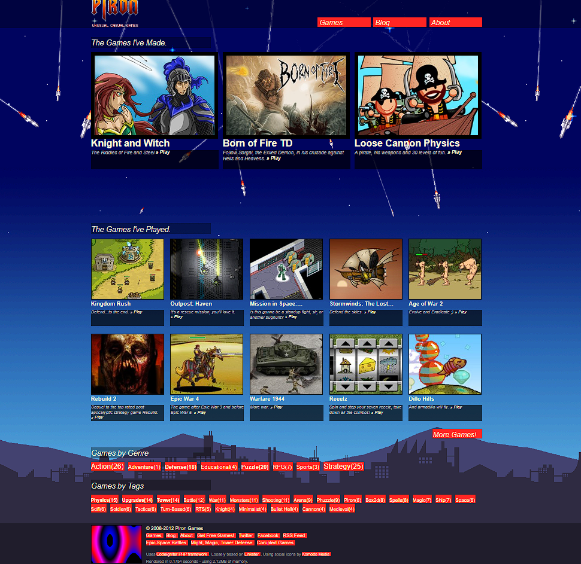

# PironGames.com Website (Version 4)

This is the [Piron Games](https://www.pirongames.com) arcade, which was live between 2010-2018. Showcases all the Flash games developed by myself, as well as games I played back in the day.

It's based on the CodeIgniter framework and Linkster, adding virtual game arcade related features. It also implements a leaderboard system (available inside games), which was working in tandem with the [Piron Games Haxe/Flash GameLib2](https://github.com/stefandee/hxgamelib2)

The arcade lacks an admin feature, to make it easy to upload/set up new games - didn't find the time to implement it, given that I wasn't uploading guest content regularly. Instead, this process was done by editing the tables directly with phpMyAdmin.

Web development is/was not my area of expertise, so this whole thing is experimental bordering jerry-rigged. It did its job though, until I finally sun-set and replaced it with a fully Wordpress solution in 2018.

Score submission code doesn't blacklist improper submitted names and is down-right vulnerable to SQL injection (submit_stat function in [gamelist_model.php](application/models/gamelist_model.php))

Also included are PSDs of various concepts I envisioned for the site, until I settled to the retro/8-bit theme. Was planning to animate the "Missile Command" inspired background or even turn it into a minigame, never got around to do it though.

## Requirements

PHP 4.3.2 and MySql (might work on newer versions)

## Installation

Rename [database _template.php](application/config/database _template.php) to database.php and fill in the configuration:

```sql
$db['default']['hostname'] = "hostname";
$db['default']['username'] = "username";
$db['default']['password'] = "password";
$db['default']['database'] = "database";
```

A table dump .sql file made cca 2018 is available [here](.database/piron-games-arcade-db-v4.sql). Import it into the database filled above.

## Screenshots


